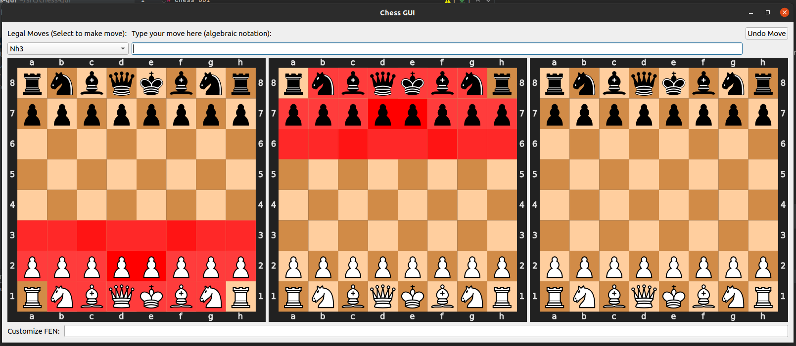

# Chess GUI

Simple visualizer for attacked squares in chess. The program shows which squares are attacked and how many times
for each color.

## Dependencies
To run this script you'll need to install python packages `numpy`, `PyQt5`, and `chess`

## Running
To run the app, you need to run the main python file which is located in `./app/`
```commandline
python3 main.py
```

This will bring up the main GUI:


These are the features so far:
 * Upper left dropdown: Shows a list of current legal moves. Selecting one will play that move on the board
 * Upper middle textbox: Typing a legal move in algebraic notation will play that move on the board
 * Upper right button: Pressing this will undo any moves played
 * Center left board: Shows the squares attacked by white (darker red means multiple attackers)
 * Center middle board: Shows the squares attacked by black
 * Center right board: Shows pieces that are over-attacked in red
 * Lower textbox: Allows you to input a custom FEN