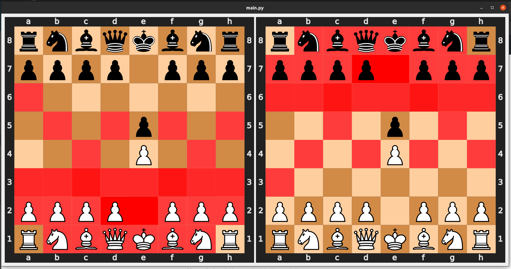

# Chess GUI

Dead simple single-script visualizer for chess positions. The program shows which squares are attacked and how many times
for each color. Just give it a FEN and it will generate visualizations.

Maybe at some point I'll add more to it, but for now this was what I really wanted to see.

## Dependencies
To run this script you'll need to install python packages `numpy`, `PyQt5`, and `chess`

## Example running
```commandline
python3 main.py
---------------------------------------------------------------
> Type the fen:
rnbqkbnr/pppp1ppp/8/4p3/4P3/8/PPPP1PPP/RNBQKBNR w KQkq - 0 2
```

Will show:
